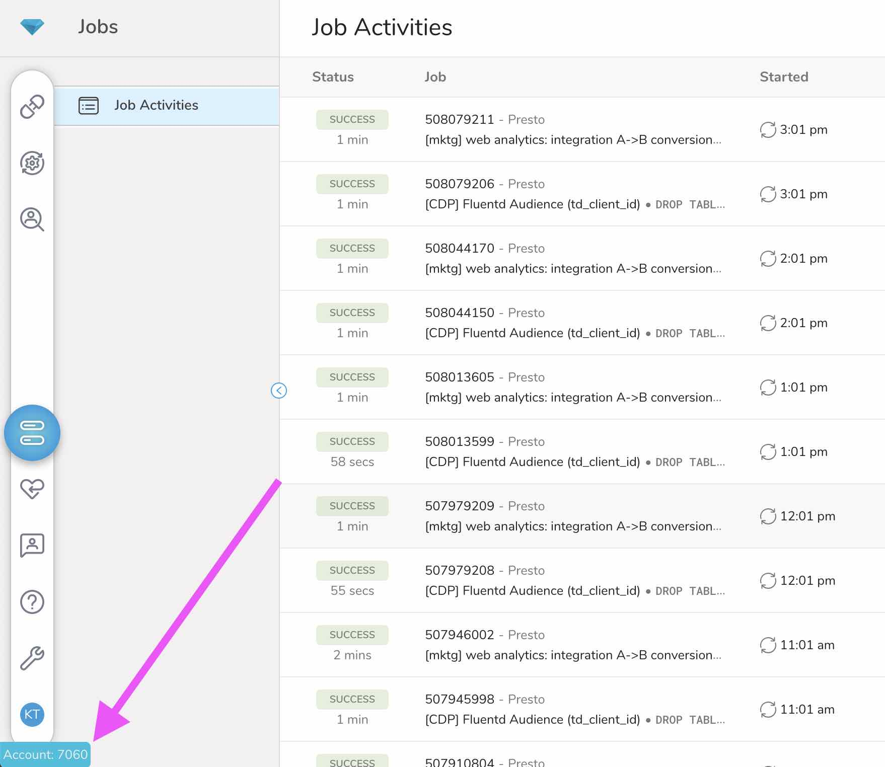

# Which TD? - Chrome Extension to know which account you are logged into

This is a simple Chrome Plugin to know which TD account you are logged into.

## How To Use

1. Downloads or clone this repository.
2. Open URL `chrome://extensions` in Google Chrome
3. Toggle on "Developer Mode" in the top right.
4. Click "Load unpacked", select the repository folder downloaded in Step 1.
5. Now you know which TD account you are logged in without navigating away from your work.
